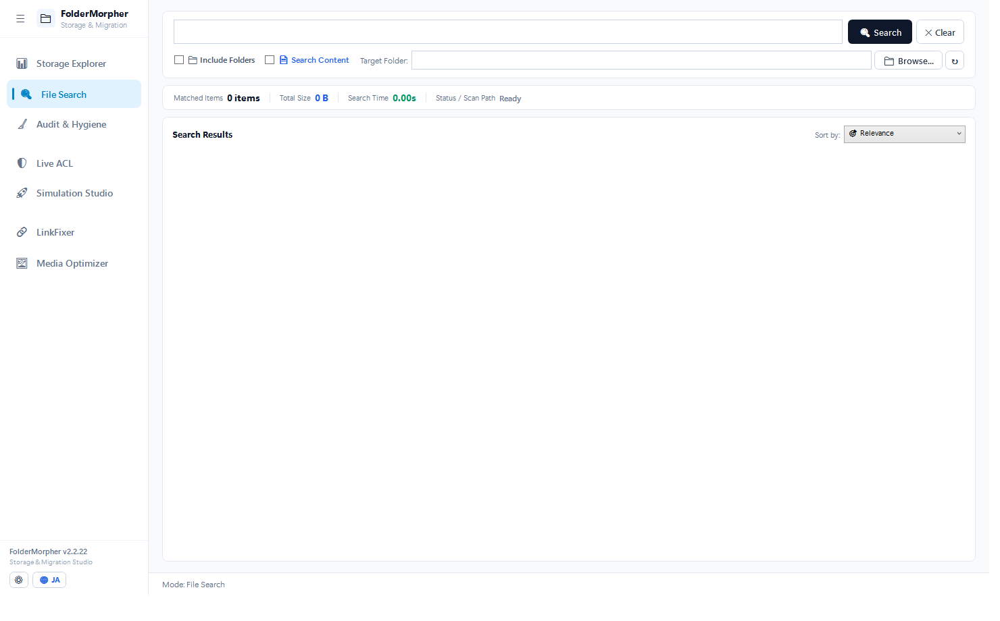

# FolderMorpher — Windows Storage Management, Audit & Migration Studio

> **Complete Windows file server storage analysis, fast search, NTFS permission auditing, and migration restructuring in a single portable tool.**  
> An all-in-one, zero-dependency, portable Windows GUI utility built for SysAdmins and IT teams. Handles disk space monitoring, in-memory file & full-text search, virtual tree redesign (N:1 mapping), live NTFS permissions with SDDL rollback, broken shortcut/Office link fixes (with VBA macro preservation), image optimization, and Excel audit reporting.


-purple.svg)


🌐 **Language**: **[🇺🇸 English]** | [🇯🇵 日本語 (README_JA.md)](README_JA.md)

---

## 📢 Community Feedback & Testing

We welcome test reports and feedback from real-world storage environments (Windows Server, NetApp, Synology, QNAP, etc.). Please submit issues or requests via [GitHub Issues](../../issues).

---

## 🛡️ Operational Philosophy: Two Worlds & 3-Stage Rocket

FolderMorpher separates observation from state mutation to keep exploration fast while keeping disk writes safe:

| Category | Targeted Actions | UX Behavior |
| :--- | :--- | :--- |
| **Observation & Generation**<br>*(Read-Only & Script Export)* | • Storage scanning & tree navigation<br>• Fast file & content search<br>• AD reverse effective access auditing<br>• Dormant & duplicate file inventory<br>• Excel / CSV ledger export<br>• GPO script (.ps1) export | **Instant Execution**<br>(No blocking dialogs or dry-run steps — zero friction during administrative exploration) |
| **Mutation & Intervention**<br>*(State-Altering Disk Writes)* | • **Live ACL Direct Commit**<br>• **Skeleton Tree Deployment**<br>• **Shortcut Direct Repair**<br>• **Photo Overwrite Optimization** | **Plan First (3-Stage Rocket)**<br>`[ Check ]` ➔ Modal **`⚖️ Changes`** (Before/After preview) ➔ `[ Apply ]` ➔ Automatic Semantic **Verify** |

---

## 🌟 7 Core Pillars

### 1. 📊 Storage Explorer (Capacity Monitoring & Tree Cache)

- **Tree Cache & Background Auto-Diff**: Restores previous directory hierarchies instantly from local/shared cache while running background scans. Automatically tags changed folders with growth/reduction badges (`▲ +2.4GB` / `▼ -500MB`).
- **NTFS MFT Direct Scanning**: Binary parsing of the NTFS Master File Table (`$MFT`) for fast local volume indexing. Automatically falls back to parallel scanning for network shares (UNC).
- **Occupancy Meter (Anti-Double Counting)**: Percentage reflects absolute share of the scanned root, cleanly separated from direct subfolder shares.
- **Top 10 Largest Files**: Quickly locate massive space-hogging files. Double-click to highlight directly in Windows Explorer.
- **Multi-Tab Scanning**: Scan and monitor multiple local drives and UNC network shares (`\\server\share`) side-by-side.

---

### 2. 🔍 File Search (Search Studio)

- **In-Memory & Direct Scanning**: Instant search across pre-scanned tree caches, with direct streaming traversal for unscanned folders and UNC shares.
- **Everything-Compatible Syntax**: Filter by extension (`ext:xlsx,docx`), size (`size:>100MB`), dormant duration (`dormant:>3y`), path length (`pathlen:>240`), and invalid characters (`chars:illegal`).
- **Full-Text Content Search**: High-performance content indexing utilizing Windows native IFilter and pure C# streaming fallback for PDF, Office (Excel sharedStrings / Word / PowerPoint), and text files.
- **Name-First Matching**: Matches keywords against file names by default to prevent parent path false-positive blowups. Optional "Include Folders" checkbox for folder discovery.
- **Studio Integration Hub**: Send search results directly to Live ACL, Simulation Studio, LinkFixer, or Audit with one click.

---

### 3. 🛡️ Live ACL Studio (NTFS Control & Reverse Effective Access)

- **Unified AclChangePlan Pipeline**: Single execution plan across dry-run preview and commit to eliminate logic discrepancies.
- **Clean Card UI**: Vertical cards displaying Account Name, Identity, Rights, AppliesTo, and Inherited status. Drag accounts from the AD palette, or drag out-of-bounds to safely remove.
- **Inheritance Transition Warning Banner**: Prominently warns when disabling inheritance, displaying the exact count of inherited ACEs being promoted to explicit entries.
- **Semantic Verification (Verify)**: Post-commit, re-reads native NTFS ACL from the OS kernel and verifies semantic equivalence against expected ACE rules.
- **Reverse Effective Access Inspector**: Resolves deep AD security group nesting (`LDAP_MATCHING_RULE_IN_CHAIN` / tokenGroups) and evaluates Windows Canonical DACL Ordering (Explicit Allow over Inherited Deny) with exact grant path tracing and Excel reporting.
- **SDDL Instant Snapshot & Rollback**: Backs up native DACL SDDL prior to commit for instant atomic recovery.

---

### 4. 🚀 Simulation Studio (Virtual Tree Design & Skeleton Deployment)

- **Virtual Tree Design & N:1 Consolidation**: Visually map legacy departmental structures into clean target hierarchies via drag-and-drop with recursive ACL inheritance.
- **Skeleton Deploy**: Pre-deploy empty folder hierarchies with designed NTFS ACLs before kicking off data copy jobs via the **`⚖️ Changes`** review modal.
- **Visual Diff Inspector**: Review New, Moved, Merged, and Permission Deltas with one-click Excel export.
- **Isolated Robocopy Modes**: Choose between "Preserve Designed ACLs Mode (`/COPY:DAT`)" or "Preserve Legacy ACLs Mode (`/COPYALL`)".
- **Enterprise Migration Package Generator**: Outputs wave planning, pre-cutover freeze runbooks, Robocopy scripts, and migration tracking workbooks (`Migration_Runbook.xlsx`).

---

### 5. 🔗 LinkFixer (Shortcut & Office Link Repair)

- **Shortcut (`.lnk`) Direct Repair**: Review targeted shortcuts and old-to-new path replacements in the **`⚖️ Changes`** modal, then rewrite with automatic `.bak` safety backups.
- **Office Internal Link Repair & Macro Protection (`.xlsx`, `.xlsm`)**: Inspects OpenXML packages without Office COM. Fixes broken external formula workbook links and worksheet references, while detecting hardcoded VBA UNC paths (macro binaries remain protected).
- **Domain-Wide GPO Logon Script Generator (`.ps1`)**: Outputs ready-to-deploy PowerShell logon scripts to repair client PCs automatically at login.

---

### 6. 🧹 Audit & Hygiene (Deduplication & Storage Governance)

- **Cryptographic Duplicate Detection**: Size pre-filtering followed by SHA256 verification.
- **Dormant Files**: Identifies stale files unmodified for 3+ years while protecting files accessed within the last 365 days.
- **Path Limits (240+ Chars) & Invalid Characters**: Catches long paths (>=240 chars) and illegal characters (`* : < > ? \ / | "`) that break migrations.
- **Smart Selection & Original Protection**: Safely select duplicate copies while strictly protecting original candidate files (`IsOriginalCandidate`).
- **Safe Inventory**: Generates hyperlinked audit sheets (Excel/CSV) and supports guarded physical deletion.

---

### 7. 🖼️ Media Optimizer (In-Place Image Slimmer & GPU Video Batch)

- **Protection Folders (Auto-Skip)**: Automatically protects designated master folders (`_Master`, `RAW`, `印刷用`) and professional formats (`.psd`, `.ai`, `.raw`).
- **In-Place Image Optimization**: Resizes large photos to 2560px max dimension at 85% JPEG quality directly in-place, and optimizes PNGs while preserving alpha transparency. Preserves EXIF metadata, timestamps, and orientation.
- **Dry-Run Changes Inspection**: Review affected files and protection exclusions in the **`⚖️ Changes`** modal before commit.
- **Large Video Ranker & Nightly GPU Batch**: Extracts multi-gigabyte video files and generates GPU-accelerated (H.265) overnight encoding batch scripts.

---

## 🚀 Download & Quick Start

### Requirements
- OS: Windows 10 / Windows 11 / Windows Server 2016 or later (64-bit)
- No additional runtimes or installers required (Self-Contained Single EXE).

### Usage
1. Download `FolderMorpher.exe` from [**Releases**](../../releases).
2. Double-click to launch. No installation or registry modifications.

---

## 🛠️ Tech Stack & Architecture

- **Language / Runtime**: C# 12 / .NET 8.0 Windows Desktop SDK (Self-Contained Single EXE)
- **UI Framework**: WPF (Windows Presentation Foundation) / Fluent Light Design
- **Directory Services**: `System.DirectoryServices` (LDAP / ADSI)
- **Security**: `System.Security.AccessControl` (NTFS ACL / SDDL)
- **Excel Generation**: `ClosedXML` (OpenXML direct generation)
- **Imaging Engine**: WIC (Windows Imaging Component)
- **Quality Gate**: Headless automated regression test suite (`--test-regression`) covering all 8 domains.
- **Architecture Guidelines**: Architecture Decisions recorded in [`AGENTS.md`](AGENTS.md).

---

## 📜 License (MIT License)

This project is licensed under the **[MIT License](LICENSE)**.

```text
Copyright (c) 2026 iwmn-9
```

---

## 📄 Disclaimer

FolderMorpher is an administrative utility designed to assist with file server analysis, migration, and hygiene. While destructive actions include safety guards (pre-commit change modals, automated SDDL rollbacks, `.bak` backups, and original protection), the software is provided AS IS without warranty. Always maintain verified backups prior to executing bulk modifications on production file servers.
