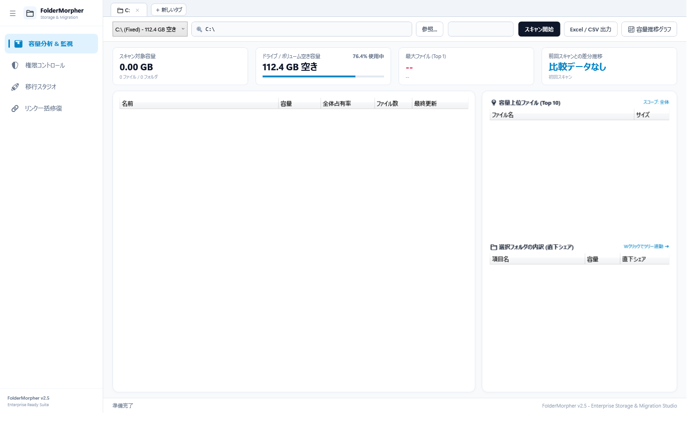
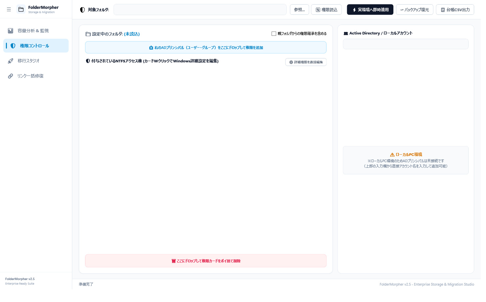
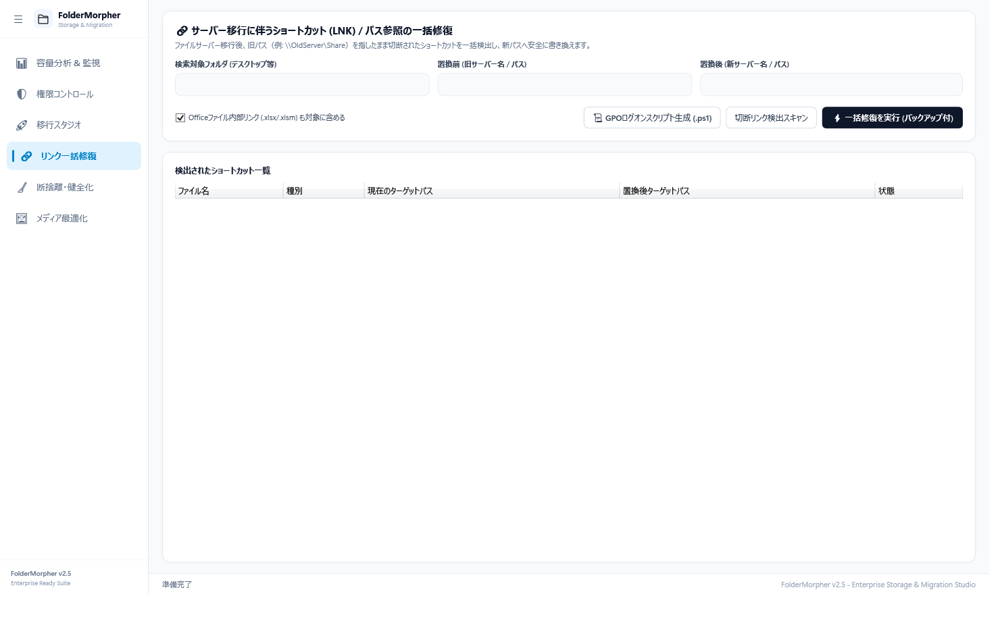
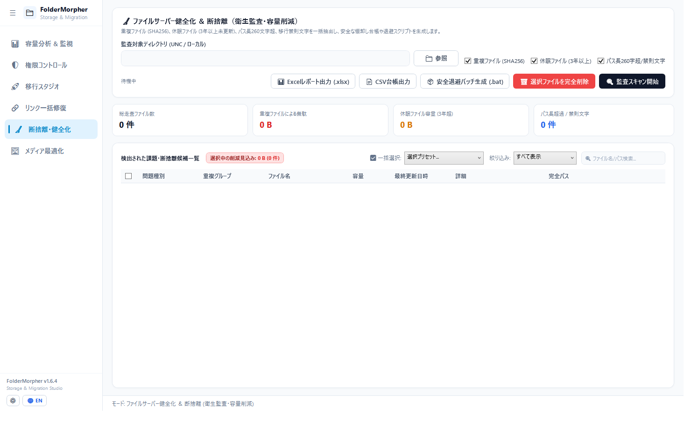
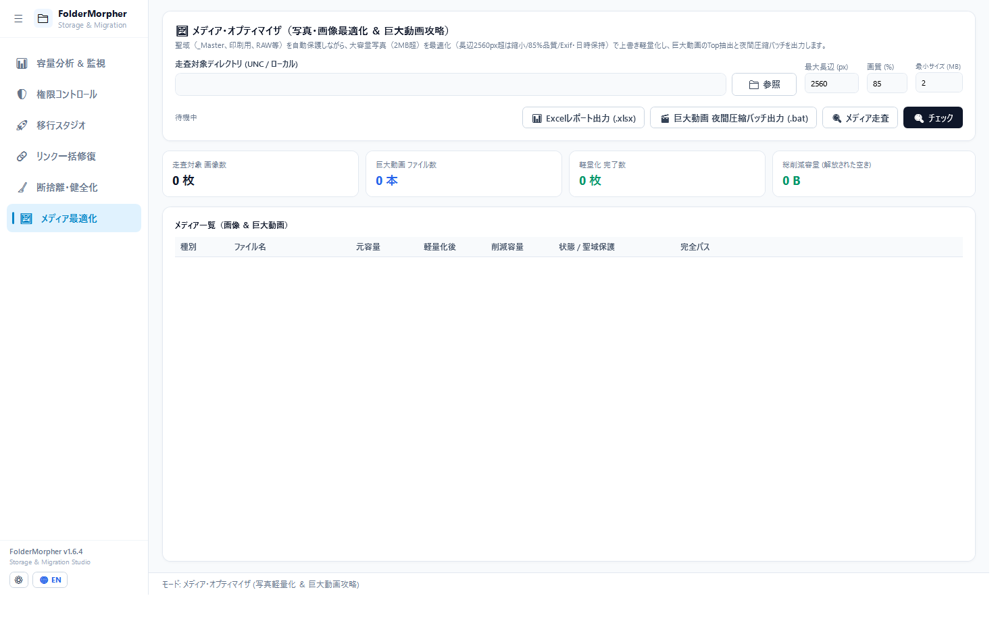

# 🚀 FolderMorpher — 情シス運用統合スイート
### (IT Admin Storage, Audit & Migration Studio)

> **「脱・数千万円のGDMS」「もうファイルサーバー移行で血反吐を吐かない」**  
> 大容量ファイルサーバーの日常監視から、組織改編・部署名リネーム、新環境への仮想ツリー設計、実環境NTFSアクセス権管理、切断ショートカット・Officeマクロ一括修復、写真の視覚的ロスレス90%軽量化までを**1本の単一EXE（インストール不要）**で完結させるプロフェッショナル向けGUIスタジオです。


-purple.svg)


🌐 **Language**: [🇺🇸 English (README.md)](README.md) | **[🇯🇵 日本語]**

---

## 📢 先行プレビュー公開 ＆ 動作フィードバック大募集中！

本ツールは、全国の社内SE・情シスが直面する泥臭いファイルサーバーの課題を解決するために本気で開発されています。

- 「自社のストレージ（NetApp, Windows Server, Synology, QNAP等）で動かしたらこんな結果が出た」
- 「この形式のExcel数式やマクロでうまく置換できなかった」
- 「移行現場でこういう機能が追加であったら神ツールになる」

といった現場のリアルな動作報告やご要望を大歓迎しています。お気軽に [GitHub Issues](../../issues) へお寄せください！

---

## 🌟 6大コア機能

### 1. 📊 容量分析 & 監視 (Storage Explorer)

- **全体占有率メーター（二重加算防止）**: スキャンルート全体（100%）に対する絶対シェアと、右ペインでの選択フォルダ直下シェアを完全分離。
- **Top 10 ランキング ＆ エクスプローラー直行**: 肥大化の元凶ファイルを特定し、ダブルクリックで対象ファイルを青く選択した状態でエクスプローラーを即時起動。
- **マルチタブ同時スキャン**: 複数ドライブや別サーバー（UNC共有 `\\server\share`）を並行監視。

---

### 2. 🛡️ 権限コントロール & SDDLロールバック (Live ACL)

- **実環境NTFS権限の直接編集**: Active Directoryのアカウント・グループをドラッグ＆ドロップで追加、ゴミ箱ゾーンへポイ捨て削除。
- **Windows詳細セキュリティ完全準拠**: 基本6項目 ＋ 高度なアクセス許可14項目（走査/属性/所有権など）を完全双方向連動で編集。
- **SDDL直前自動スナップショット（即座に復元）**: 適用直前の権限状態を自動退避。「↩️ バックアップ復元」でいつでも直前の状態へ原子的ロールバック可能。
- **アクセス権マトリクス台帳CSV出力**: 監査用の権限台帳を1クリック出力。

---

### 3. 🚀 移行スタジオ & ガワ先行展開 (Simulation Studio)

- **仮想ツリー設計 ＆ N:1統合マッピング**: 「旧営業A」「旧営業B」を新環境の「営業第一部」へまとめる統合ツリーを視覚的に設計。
- **ガワ先行作成（スケルトン一括展開）**: 大容量データ転送の前に、空フォルダ構造と設計済みNTFS ACLだけを新サーバーに先行作成。
- **Diffインスペクター**: 移行前後（Before/After）の変化点（新規・移動・統合・ACL差分）をカラーバッジでレビュー。
- **Robocopy自動生成**: 最適化されたマルチスレッド移行バッチ（`/MT:16 /COPYALL`）を1クリック生成。

---

### 4. 🔗 リンク一括修復 ＆ GPOスクリプト生成 (LinkFixer)

- **切断ショートカット（`.lnk`）の一括救済**: サーバー移行や部署名変更で切断されたショートカットを新パスへ自動書き換え（`.bak` 自動バックアップ）。
- **Office内部リンク・マクロ修復**: Office COMを起動せず、OpenXML（.xlsx/.xlsm）ZIP内部XMLおよび旧バイナリ（.xls）を直接高速走査。外部ブック参照数式やVBAパスを安全置換（`~$` ロック検知付き）。
- **GPOログオンスクリプト生成（`.ps1`）**: 全社PCのデスクトップ・マイドキュメント等のショートカットをサイレント一括修復する管理者用スクリプトをワンクリック生成。

---

### 5. 🧹 断捨離・健全化 (Audit & Hygiene - GDMS完全代替)

- **高額パッケージ（GDMS等）の完全代替**:
  - **重複ファイル検出**: ファイルサイズ絞り込み ➔ SHA256ハッシュ判定による完全一致判定。無駄容量を算出。
  - **休眠ファイル抽出**: 3年以上アクセスのない放置データを抽出。
  - **パス長（260字超）＆ 移行禁則文字チェック**: クラウド（SharePoint/Box）やWindows移行でエラーになる記号や長大パスを事前洗い出し。
- **安全第一の運用ポリシー**: ツールによる自動削除は行わず、各部署提出用の**「棚卸し台帳（Excel/CSV）」**および**「安全退避（Archive移動）バッチ」**の生成に留めます。

---

### 6. 🖼️ メディア・オプティマイザ (Storage Slimmer)

- **聖域保護（自動スキップ）**: `_Master`, `印刷用`, `RAW`, `.psd`, `.ai` などのフォルダ名・プロ用拡張子は自動スキップ。
- **写真の視覚的ロスレス軽量化**: 日常のスマホ写真（2MB超）を長辺2560px・85%品質で直接上書き軽量化（**約90%の容量削減**）。撮影日時・更新日時・作成日時・Exif・回転情報は100%維持。
- **巨大モンスター動画Topランキング**: ギガ単位を消費する動画ファイルを容量順に抽出し、**夜間GPUエンコード（H.265 / NVENC / QSV）バッチ**を出力。

---

### 7. 📊 エグゼクティブExcelレポート出力
- PCにOffice/Excelがインストールされていない環境でも動作（ClosedXMLベース）。
- エグゼクティブサマリー、KPIカード、課題別集計、オートフィルター付き。
- **完全パスのセルをクリックすると、エクスプローラーでそのフォルダが直接開く `file:///` ハイパーリンクを自動埋め込み**。

---

## 🚀 ダウンロード & 起動方法

### 動作要件
- OS: Windows 10 / Windows 11 / Windows Server 2016 以降 (64-bit)
- 追加ランタイムやインストーラーは**一切不要**（単一EXEに全て同梱）。

### 起動手順
1. 本リポジトリのルートにある [**`FolderMorpher.exe`**](FolderMorpher.exe)（または [Releases](../../releases)）をダウンロードします。
2. そのままダブルクリックして起動してください。

---

## 🛠️ 技術スタック & アーキテクチャ

- **言語 / ランタイム**: C# 12 / .NET 8.0 Windows Desktop SDK (Self-Contained)
- **UIフレームワーク**: WPF (Windows Presentation Foundation) / Fluent Design
- **ディレクトリサービス**: `System.DirectoryServices` (LDAP / ADSI)
- **セキュリティ**: `System.Security.AccessControl` (NTFS ACL / SDDL)
- **Excel生成**: `ClosedXML` (OpenXML直接バイナリ生成)
- **画像エンジン**: WIC (Windows Imaging Component / ハードウェアアクセラレーション)
- **アーキテクチャ規約**: [`AGENTS.md`](AGENTS.md) にてサービス層とUI層を疎結合に保つADR（設計判断）を厳格に管理。

---

## 🤖 AI主導の保守・Issue対応について

本プロジェクトは、人間による設計方針・品質ガバナンスのもと、**自律型AIエージェント（Google DeepMind Antigravity / Gemini）を活用して開発・保守**されています。

- **Issue対応**: [Issues](../../issues) に投稿された不具合報告や機能追加の要望は、AIエージェントがコード解析・再現テスト・修正パッチの作成を行い、迅速にアップデートされます。
- **報告時のお願い**: AIによる調査・修正精度を高めるため、可能であれば以下の情報を含めていただけるとスムーズです。
  1. 発生時のスクリーンショットやエラーログ
  2. 再現手順や対象フォルダの構成
  3. 動作環境（OSバージョン、ドメイン参加有無、対象ストレージの種別：ローカルNTFS / SMB共有 / NAS 等）
- **Pull Request**: コミュニティからの改善PRも歓迎します。自動統合テストおよびヘッドレス検証を経てマージされます。

---

## 📜 ライセンスと著作権表示（MIT License）

本プロジェクトは **[MIT License](LICENSE)** に基づいて公開されています。

- **利用の自由**: 個人・商用問わず、自由に使用・改変・再配布・商用利用が可能です。
- **著作権表示のお願い**: 本コードを改変または二次配布（フォーク等）される場合は、MITライセンスの規定に基づき、以下の原作者クレジット・著作権表示をコードおよび配布物内に維持してください。
  ```text
  Copyright (c) 2026 iwmn-9
  ```

---

## 📄 免責事項 (Disclaimer)

FolderMorpher はファイルサーバーの調査・移行・管理を支援する管理者向けユーティリティです。安全設計（SDDL自動ロールバック復元、`.bak` バックアップ生成、ステージング退避移動など）を実装していますが、本ソフトウェアは現状有姿（AS IS）で提供され、いかなる保証も伴いません。本番ファイルサーバーで一括操作を実行する際は、必ず事前にバックアップを確保した上でご活用ください。

