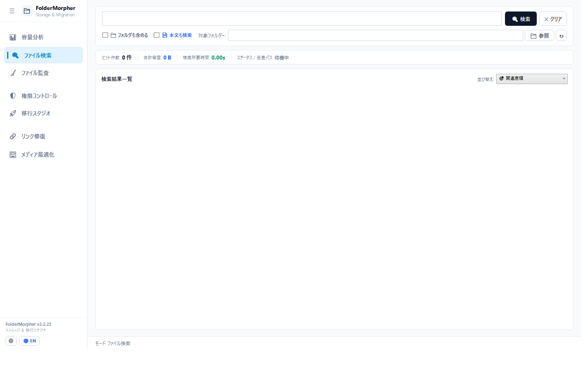

# FolderMorpher — Windows ストレージ管理・監査・移行スイート
### (IT Admin Storage, Audit & Migration Studio)

> **Windows ファイルサーバーの容量分析・ファイル検索・NTFSアクセス権監査・フォルダ再編移行を 1 本で完結。**  
> ファイルサーバーのツリー走査から、高速ファイル検索、組織改編・新環境への仮想ツリー設計、実環境NTFSアクセス権管理、切断ショートカット・Office内部リンク修復（VBAマクロ保護）、写真の軽量化までを**1本の単一EXE（インストール不要）**で完結させる管理者向けユーティリティです。


-purple.svg)


🌐 **Language**: [🇺🇸 English (README.md)](README.md) | **[🇯🇵 日本語]**

---

## 📢 動作フィードバックについて

実環境ストレージ（Windows Server、NetApp、Synology、QNAP等）での検証結果やご要望をお待ちしています。お気軽に [GitHub Issues](../../issues) へお寄せください。

---

## 🛡️ 操作設計：観測系と介入系の分離

FolderMorpher は、探索時の軽快さを保ちつつ、データ変更時の安全性を確保する設計を採用しています：

| 区分 | 対象機能 | 挙動 |
| :--- | :--- | :--- |
| **観測・生成系**<br>*(参照・レポート出力)* | • 容量スキャン・ツリー参照<br>• 高速ファイル検索（全文検索）<br>• AD逆引き実効アクセス権監査<br>• 休眠・重複ファイル棚卸し<br>• Excel / CSV 台帳出力<br>• GPOスクリプト (.ps1) 出力 | **即時実行**<br>(確認ダイアログを挟まず、テンポよく探索可能) |
| **介入系**<br>*(ディスク実態を変更する)* | • **権限コントロール（Live ACL直接変更）**<br>• **スケルトン先行展開（空フォルダ＋ACL作成）**<br>• **ショートカット修復（.lnk直接書き換え）**<br>• **メディア最適化（写真直接上書き縮小）** | **Plan First（事前確認）**<br>`[ チェック ]` ➔ モーダル **`⚖️ 変更点`**（Before/After事前確認） ➔ `[ 適用 ]` ➔ 実態 **Verify（自動検証）** |

---

## 🌟 7大機能

### 1. 📊 容量分析 (Storage Explorer)

- **ツリーキャッシュ ＆ 差分スキャン**: スキャン開始時、前回キャッシュがあればツリー構造を即座に展開。バックグラウンドで最新走査を実行し、容量が変化したフォルダに増減バッジ（`▲ +2.4GB` / `▼ -500MB`）を自動付与。
- **NTFS MFT直読みスキャン**: 管理者権限でのローカルNTFSドライブ（またはファイルサーバー直接実行時）において、ディスク管理領域（`$MFT`）を直接解析し、高速にインデックス化。UNC共有や一般権限時は自動で並行スキャンへフォールバック。
- **全体占有率メーター**: スキャンルート全体（100%）に対する絶対シェアと、右ペインでの選択フォルダ直下シェアを分離表示。
- **Top 10 ランキング**: 肥大化の元凶ファイルを特定し、ダブルクリックで対象ファイルを選択した状態でエクスプローラーを起動。
- **マルチタブ同時スキャン**: 複数ドライブや別サーバー（UNC共有 `\\server\share`）を並行監視。

---

### 2. 🔍 ファイル検索 (Search Studio)

- **インメモリ即時検索 ＆ 直接走査**: スキャン済みツリーに対するインメモリ検索と、未スキャンフォルダに対する直接走査の両方に対応。
- **Everything互換クエリ構文**: 拡張子（`ext:xlsx,docx`）、サイズ（`size:>100MB`）、休眠期間（`dormant:>3y`）、パス長（`pathlen:>240`）、禁則文字（`chars:illegal`）等の柔軟な絞り込み。
- **全文検索エンジン**: Windows IFilter および純C#ストリーム抽出による PDF・Office（Excel/Word/PowerPoint）・テキストの高速全文検索。
- **ファイル名優先照合**: 既定ではファイル名そのものにヒットさせ、親フォルダ名による巻き添えヒットを防止。「フォルダも含める」オプションでフォルダ自体の検索も可能。
- **各機能への連携**: 検索結果から Live ACL、移行スタジオ、リンク修復、ファイル監査へワンクリックで転送。

---

### 3. 🛡️ 権限コントロール & 逆引き監査 (Live ACL Studio)

- **実行計画（AclChangePlan）の統一**: 差分プレビューと本番適用で同一の実行計画インスタンスを貫通させ、PreviewとCommitの乖離を防止。
- **カード型UI**: アカウント名、権限、適用先、継承状態を整理して表示。ADパレットからのドラッグ＆ドロップに対応。
- **継承変更警告バナー**: 継承を無効化する際、親から明示ACEへ昇格・保持される件数を明示し、アクセス権遮断を事前警告。
- **セマンティック正常性検証**: 適用直後、OSカーネルから再取得した実態ACEと期待値を突合し、完全一致（`✅ 正常`）を自動検証。
- **ユーザー/グループ逆引き権限インスペクター**: 対象アカウントを選択し、ファイルサーバー全体を逆引きスキャン。多重ネストグループを解決し、Windowsの正規DACL評価順序に基づいてアクセス可能フォルダと権限種別を可視化。
- **SDDL直前自動スナップショット**: 適用直前のDACL SDDLを自動退避。「↩️ バックアップ復元」でいつでも直前の状態へロールバック可能。

---

### 4. 🚀 移行スタジオ & スケルトン先行展開 (Simulation Studio)

- **仮想ツリー設計 ＆ N:1統合マッピング**: 複数フォルダを新環境へまとめる統合ツリーを視覚的に設計。階層フォルダの再帰的ドラッグ＆ドロップとACL引き継ぎに対応。
- **スケルトン先行展開**: データ転送の前に、空フォルダ構造と設計済みNTFS ACLだけを新サーバーに先行作成。モーダル **`⚖️ 変更点`** で差分確認後に適用し、実在検証。
- **Diffインスペクター**: 移行前後（Before/After）の変化点（新規・移動・統合・ACL差分）をレビューし、Excel出力。
- **Robocopyモード分離**: 「新設計ACL維持モード（`/COPY:DAT`）」と「旧環境ACL維持モード（`/COPYALL`）」を明示分離。
- **エンタープライズ移行パッケージ生成**: 波次（Wave）自動分割、安全停止手順書、Robocopyバッチ、進捗管理台帳（Migration_Runbook.xlsx）を一括出力。

---

### 5. 🔗 リンク修復 (LinkFixer)

- **ショートカット（`.lnk`）の直接修復**: モーダル **`⚖️ 変更点`** で置換対象と新旧パスを確認し、`.bak` 安全バックアップを自動生成しながら直接書き換え。
- **Office内部リンク修復 ＆ マクロ保護**: Office COMを起動せず、OpenXML（.xlsx/.xlsm）内部XMLを直接走査。外部ブック参照数式やワークシートリンクを置換、VBA内の旧UNCパスを検知（マクロバイナリは保護）。
- **GPOログオンスクリプト生成（`.ps1`）**: クライアントPCのショートカットを修復する配布用スクリプトを出力。

---

### 6. 🧹 ファイル監査 (Audit & Hygiene)

- **重複ファイル検出**: サイズ絞り込み ➔ SHA256ハッシュによる照合。無駄容量を算出。
- **休眠ファイル抽出**: 3年以上更新されていない放置データを抽出。直近1年間に閲覧されたファイルは保護。
- **パス長（240字超）＆ 移行禁則文字チェック**: クラウド移行やWindows制約に抵触する記号や長大パスを事前抽出。
- **原本候補保護**: 重複原本（`IsOriginalCandidate`）を保護しながらコピーファイルのみを選択。
- **安全第一の運用**: 棚卸し台帳（Excel/CSV）を出力し、手動オプトインによる完全削除に対応。

---

### 7. 🖼️ メディア最適化 (Media Optimizer)

- **保護対象フォルダーの自動スキップ**: `_Master`, `印刷用`, `RAW` 等のフォルダーやプロ用拡張子は自動スキップ。
- **写真・画像の直接上書き最適化**: 大容量写真を長辺2560px・85%品質で直接上書き軽量化（PNGは透過を維持）。撮影日時・Exif情報を保持。
- **事前チェック ＆ 実態Verify**: モーダル **`⚖️ 変更点`** で対象写真と除外数を確認して適用、削減容量を自動検証。
- **大容量動画ランキング**: 大容量動画ファイルを容量順に抽出し、夜間GPUエンコード（H.265）バッチを出力。

---

## 🚀 ダウンロード & 起動方法

### 動作要件
- OS: Windows 10 / Windows 11 / Windows Server 2016 以降 (64-bit)
- 追加ランタイムやインストーラーは不要（単一EXEに同梱）。

### 起動手順
1. [**Releases**](../../releases) から最新の実行ファイル（`FolderMorpher.exe`）をダウンロードします。
2. そのまま実行してください。インストーラーやレジストリ設定は不要です。

---

## 🛠️ 技術スタック & アーキテクチャ

- **言語 / ランタイム**: C# 12 / .NET 8.0 Windows Desktop SDK (Self-Contained 単一実行ファイル)
- **UIフレームワーク**: WPF (Windows Presentation Foundation) / Fluent Light Design
- **ディレクトリサービス**: `System.DirectoryServices` (LDAP / ADSI)
- **セキュリティ**: `System.Security.AccessControl` (NTFS ACL / SDDL)
- **Excel生成**: `ClosedXML` (OpenXML直接生成)
- **画像エンジン**: WIC (Windows Imaging Component)
- **品質保証**: 全8大ドメインの自動回帰テストスイート（`--test-regression`）による常時検証。
- **アーキテクチャ規約**: [`AGENTS.md`](AGENTS.md) にて設計判断（ADR）を管理。

---

## 📜 ライセンスと著作権表示（MIT License）

本プロジェクトは **[MIT License](LICENSE)** に基づいて公開されています。

```text
Copyright (c) 2026 iwmn-9
```

---

## 📄 免責事項 (Disclaimer)

FolderMorpher はファイルサーバーの調査・移行・管理を支援する管理者向けユーティリティです。ディスク実態を変更する操作には事前確認やバックアップ・検証機構を設けていますが、本ソフトウェアは現状有姿（AS IS）で提供され、いかなる保証も伴いません。本番ファイルサーバーでの操作時は、事前にバックアップを確保した上でご活用ください。